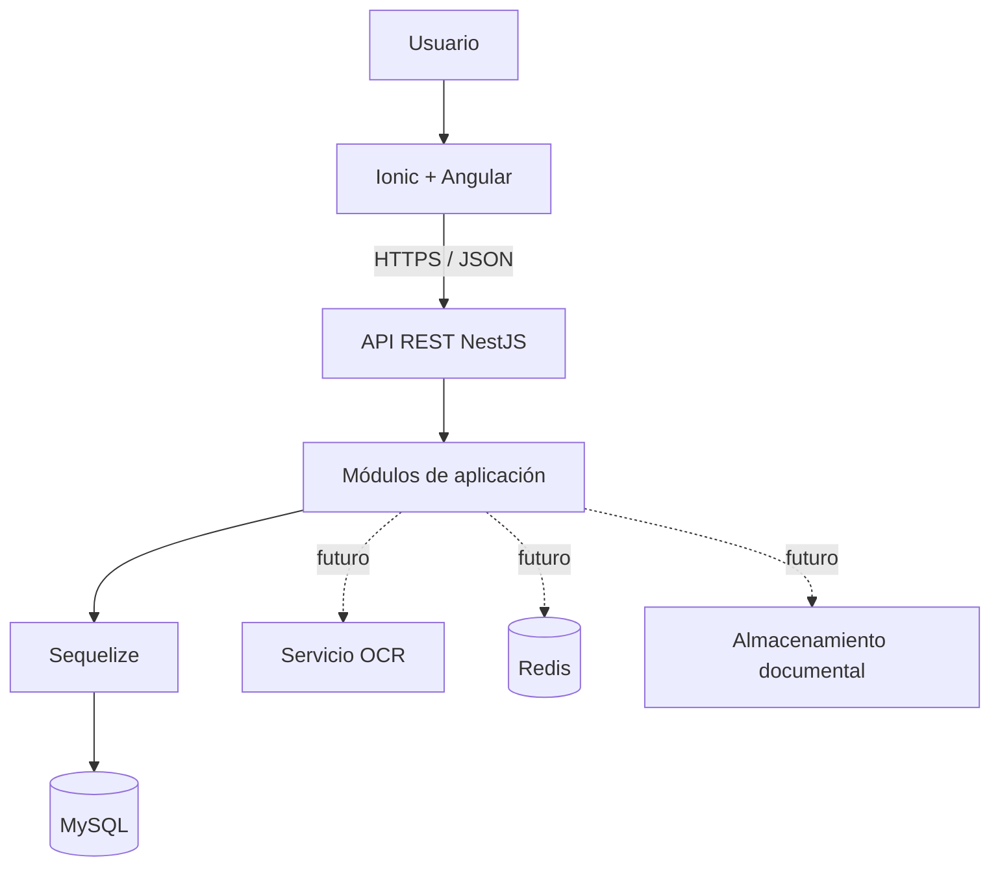
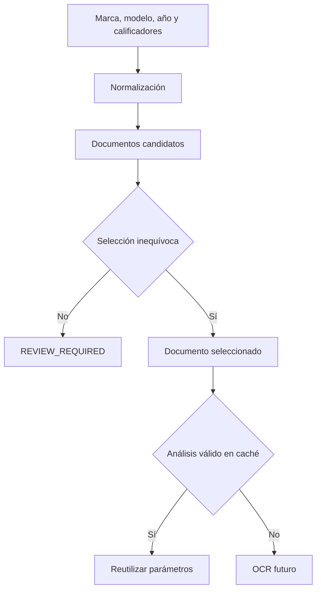
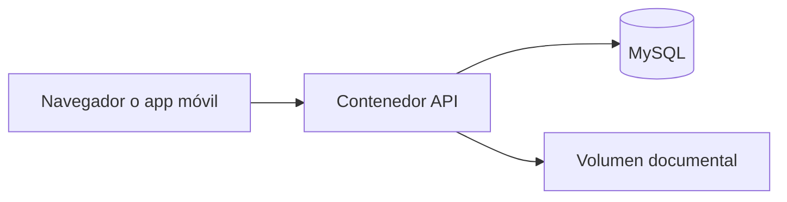

# Arquitectura de la aplicación

## 1. Propósito del documento

Este documento describe cómo se estructura técnicamente la aplicación y qué responsabilidades corresponden a cada componente.

No sustituye a:

- `PROJECT_CONTEXT.md`, que explica el problema, los usuarios y las reglas funcionales;
- `AGENTS.md`, que establece cómo debe trabajar Codex en el repositorio;
- las ADR de `docs/adr/`, que justifican decisiones concretas y conservan su historial.

Debe mantenerse actualizado cuando cambien los límites entre módulos, los mecanismos de integración, el despliegue o una decisión técnica relevante.

## 2. Estado y alcance

Arquitectura inicial aprobada para el MVP:

- arquitectura cliente-servidor;
- frontend multiplataforma;
- backend como monolito modular;
- API REST;
- base de datos MySQL unificada;
- OCR, Redis y almacenamiento documental incorporados progresivamente mediante interfaces y adaptadores.

No forman parte de la arquitectura inicial:

- microservicios;
- comunicación asíncrona distribuida entre servicios;
- GraphQL;
- múltiples bases de datos por módulo;
- reglas de compatibilidad ejecutadas en el frontend o mediante procedimientos almacenados.

## 3. Vista general



## 4. Tecnologías y responsabilidades

| Capa | Tecnología | Responsabilidad |
|---|---|---|
| Cliente | Ionic + Angular | Interfaz, navegación, formularios, presentación de estados y consumo de la API. |
| Adaptación móvil | Capacitor | Acceso progresivo a cámara, archivos y capacidades del dispositivo. |
| API | NestJS sobre Express | Autorización, validación, casos de uso, reglas de negocio y contratos REST. |
| Persistencia | Sequelize | Mapeo explícito del esquema, consultas y transacciones. |
| Base de datos | MySQL | Persistencia, relaciones, índices, historial y trazabilidad. |
| OCR futuro | Adaptador intercambiable | Extracción de campos de documentos seleccionados. |
| Redis futuro | Redis | Coordinación de trabajos, rate limiting o caché efímera cuando exista una necesidad demostrada. |
| Documentos | Adaptador de almacenamiento | Conservación y recuperación segura de PDF e imágenes. |

## 5. Estructura del repositorio

```text
proyecto/
├── AGENTS.md
├── apps/
│   ├── api/
│   └── client/
├── packages/
│   └── contracts/
├── database/
│   ├── schema/
│   │   └── technical_studies_unified.sql
│   └── README.md
├── docs/
│   ├── PROJECT_CONTEXT.md
│   ├── architecture.md
│   └── adr/
└── package.json
```

### `apps/api`

Backend NestJS. Contiene módulos funcionales, controladores, servicios, modelos Sequelize, configuración, pruebas y documentación OpenAPI.

### `apps/client`

Aplicación Ionic/Angular. No implementa reglas autoritativas de compatibilidad; presenta información y solicita operaciones al backend.

### `packages/contracts`

Tipos y contratos TypeScript que pueden compartir cliente y servidor sin depender de Angular, NestJS o Sequelize.

### `database`

Contiene la referencia reproducible del esquema y sus instrucciones de uso. Cuando sea necesario realizar el primer cambio posterior, se creará `database/migrations/` y se añadirá una migración versionada; no es necesario mantener ahora un directorio vacío.

### `docs/adr`

Una ADR registra una decisión relevante, sus alternativas y consecuencias. Ejemplos:

- `0001-monolito-modular.md`;
- `0002-sequelize-sobre-esquema-existente.md`;
- `0003-ocr-bajo-demanda-con-cache-por-hash.md`.

## 6. Módulos del backend

| Módulo | Responsabilidad principal |
|---|---|
| `health` | Estado de la API y dependencias sin revelar información sensible. |
| `clients` | Clientes y sus datos administrativos. |
| `vehicles` | Vehículos, matrícula, VIN y asociación con clientes. |
| `studies` | Alta, ampliación, cierre y consulta de estudios. |
| `assessments` | Evaluaciones y revisiones históricas por vehículo. |
| `canbus-catalog` | Consulta de fabricantes, documentos, años y calificadores CANBus. |
| `canbus-analysis` | Selección documental, análisis almacenado, parámetros y futura coordinación OCR. |
| `tachograph-catalog` | Identificadores, fuentes y decisiones de compatibilidad de tacógrafos. |
| `documents` | Metadatos, validación y acceso al almacenamiento documental. |
| `users-auth` | Usuarios, autenticación, roles y autorización cuando se incorpore. |
| `audit` | Eventos de auditoría y trazabilidad. |

Los módulos se despliegan juntos, pero conservan límites internos. Un módulo no consulta directamente las tablas privadas de otro si existe un servicio público que represente ese acceso.

## 7. Capas internas del backend

Cada módulo puede organizarse en:

```text
module/
├── presentation/       # controladores REST y DTO
├── application/        # casos de uso
├── domain/             # reglas y tipos del dominio
└── infrastructure/     # Sequelize, almacenamiento y proveedores externos
```

Esta separación se aplicará con pragmatismo. No es necesario crear capas vacías ni abstracciones que todavía no tengan una responsabilidad real.

### Flujo de una petición

1. El controlador recibe y valida el DTO.
2. Los guards verifican identidad y permisos cuando corresponda.
3. El caso de uso coordina la operación.
4. Los servicios de dominio aplican reglas de compatibilidad.
5. La infraestructura consulta o actualiza MySQL mediante Sequelize.
6. El controlador devuelve un contrato de API, no una instancia Sequelize.

## 8. Persistencia

La base se denomina `technical_studies` y es compartida por los módulos del monolito.

Principios:

- `technical_studies_unified.sql` es el esquema base completo para crear una base vacía.
- Sequelize debe mapear el esquema existente explícitamente.
- No se utilizará sincronización destructiva o automática mediante `force` o `alter`.
- Los cambios posteriores se realizarán mediante migraciones ordenadas y versionadas, creando `database/migrations/` cuando exista el primer cambio real.
- Las migraciones se aplican una única vez y deben quedar registradas.
- Los catálogos documentales no se regeneran al arrancar la aplicación.
- Los cambios que afecten varias tablas funcionales se ejecutan dentro de transacciones.

### Historial

Los resultados de un estudio no se sobrescriben. Una corrección o nueva comprobación genera una nueva `assessment_revision`.

Los parámetros CANBus aplicados al vehículo se copian a `canbus_assessment_parameter`. De esta forma, actualizar o volver a analizar un PDF no modifica resultados históricos.

## 9. Flujos principales

### Consulta CANBus inicial



La clave de caché documental combina:

- documento CANBus;
- SHA-256 del contenido del PDF;
- versión del esquema de extracción.

El nombre del archivo no es suficiente porque el fabricante puede sustituir el contenido conservando el nombre.

### Estudio técnico

1. Se identifica o crea el cliente.
2. Se asocia el vehículo mediante matrícula única.
3. Se crea o amplía un estudio.
4. Se crea una evaluación CANBus o de tacógrafo.
5. Cada resultado se guarda como revisión.
6. Se enlazan documentos, reglas y evidencias utilizadas.
7. Los cambios posteriores generan nuevas revisiones.

## 10. Contrato de API

- REST sobre HTTPS.
- JSON para datos estructurados.
- OpenAPI como documentación del contrato.
- DTO de entrada validados en el backend.
- Fechas temporales en ISO 8601 y UTC.
- Fechas de calendario, como `valid_from_date`, sin conversión de zona horaria.
- Errores con estructura estable: código, mensaje, detalles permitidos e identificador de correlación.
- Paginación para colecciones.
- No exponer modelos Sequelize directamente.

Los endpoints se diseñarán por casos de uso y no como una copia automática de todas las tablas.

## 11. Seguridad

- Secretos únicamente mediante configuración externa.
- CORS limitado por entorno.
- Validación y límites de tamaño de peticiones.
- Autorización en el backend.
- Consultas parametrizadas mediante Sequelize.
- Validación real de archivos: tamaño, tipo, extensión y firma.
- Nombres internos de almacenamiento generados por la aplicación.
- Registros sin secretos ni contenido documental completo.
- Hash SHA-256 para detectar versiones documentales, no como mecanismo de autenticación.

## 12. Despliegue inicial

Despliegue lógico mínimo:



En desarrollo se utilizará Docker Compose para MySQL y, cuando corresponda, para API y servicios auxiliares. Redis no se desplegará hasta que una funcionalidad lo necesite.

La configuración se separa por entornos y nunca se almacenan secretos reales en Git.

## 13. Observabilidad y auditoría

- Logs estructurados con identificador de correlación.
- Endpoint de salud.
- Registro de errores sin datos sensibles.
- Auditoría funcional mediante `audit_event` y `study_event`.
- Métricas y trazas se incorporarán cuando el despliegue lo requiera.

## 14. Estrategia de pruebas

- Pruebas unitarias para reglas de selección y compatibilidad.
- Pruebas de integración contra MySQL para modelos y consultas Sequelize.
- Pruebas e2e para endpoints.
- Pruebas frontend para servicios y componentes con lógica.
- Casos explícitos para resultados ambiguos, pendientes y errores OCR.

## 15. Evolución prevista

La arquitectura permite añadir sin cambiar el modelo cliente-servidor:

- OCR como adaptador;
- cola o coordinación de trabajos;
- Redis;
- almacenamiento compatible con objetos;
- captura móvil mediante Capacitor;
- autenticación y roles;
- integración con la aplicación corporativa.

Si una evolución exige modificar los límites arquitectónicos, deberá documentarse previamente mediante una ADR.
